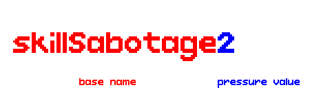

# Character Animation Documentation
This document details all valid animation names for a character.
## Animation Name Format
When a character plays an animation, the name of the animation is evaluated, and the corresponding animation is played afterwards.

To do this, each animation name follows this format:



*A base name is followed by a suffix and afterwards a pressure value.*

A **Base Name** is followed by an **Animation Suffix** and afterwards a **Pressure Value**. The name uses _camelCase_ for the capitalization.

### Base Name
The type of the animation. Examples are (introPartOne, preWin, skill).

### Animation Suffix
The "modifier" of the animation. For example, if a character wants to play a Skill animation that is exclusive to the Skill used. It first checks if the animation with that name exists (`skillSabotage2`). If it does, play the animation. If it does not, play the animation without the Animation Suffix (`skill2`).

### Pressure Value
Another modifier of the animation, but refers to the **Current Pressure** of the character. If no animation with the name that includes the Pressure Value exists, it is ignored, and it searches for one without the Pressure Value.

Pressure Value ranges from `0` to the **Max Pressure** of the user. It can also be `Overinflated` or `Null` when the character is defeated, either by Overinflation or Popping respectively.

### Failsafe
If no animation exists after doing the above checks, no animation is played, and a debug message is displayed on the console.

```
Animation [<ANIMATION_NAME>] for <CHARACTER_ID> does not exist
```

## Default Animations
Here is a list of Base Names of all animations that are used in-game by default.

Note: Some animations do not need Animation Suffixes and/or Pressure Values. If they need one, Animation Suffixes will be denoted with `$`, and Pressure Value will be denoted with `#`.

- `introPartOne`
- `introPartTwo`
- `idle#`
- `prepareShoot#`
- `shootBlank#`
- `shootLive#`
- `pass#`
- `skill$#`
- `popped`
- `helpless`
- `preWin#`
- `win#`

### introPartOne
First plays during the starting cutscene.

This animation does not loop and ends with the last frame.

### introPartTwo
Plays when the Pump Gun drops down during the starting cutscene.

This animation does not loop and ends with the `idle` animation.

### idle
The idle animation. Pretty self-explanatory.

This animation loops and ends when interrupted by another animation.

### prepareShoot
Plays when the character is preparing to make a move. Pretty self-explanatory.

This animation loops and ends when interrupted by another animation.

### shootBlank
Plays when shooting a blank round.

During normal gameplay, this animation does not loop and ends with the `pass` animation.

### shootLive
Plays when shooting a live round.

During normal gameplay, this animation does not loop and ends with the `pass` animation.

### pass
Plays when passing the Pump Gun to the next player.

This animation does not loop and ends with the `idle` animation.

### skill
Plays when activating a Skill.

This animation does not loop and ends with the `idle` animation.

### popped
Plays when player pops and is knocked-back.

This animation loops and ends with the `idle` animation after hitting the ground for the first time.

### helpless
Plays when player attempts to make a move when defeated.

This animation does not loop and ends with the `idle` animation.

### preWin
Plays when player has won and confetti pops out from the ceiling.

This animation does not loop and ends with the last frame.

### win
Plays when player has played the `preWin` animation after a short interval.

This animation does not loop and ends with the last frame.

# JSON Animation Format
All animations are registered in their JSON file in the `sprites` folder in order for them to be played in-game. They are stored as objects in an array called `"animations"`.
```json
"animations": [
		{
			"name": "idle0",
			"prefix": "idle0",
			"fps": 24,
			"offset": [0, 0],
			"indices": [],
			"loop": true
		},
		{
			"name": "idle1",
			"prefix": "idle1",
			"fps": 24,
			"offset": [0, 0],
			"indices": [],
			"loop": true
		},
		⋮
```
Each object consists of the following attributes:

### "name"
#### String
Not to be confused with `"prefix"`, this is the name of the animation used IN-GAME to play animations.

### "prefix"
#### String
Not to be confused with `"name"`, this is the name of the animation that is referred in the spritesheet (the XML file).

### "fps"
#### Integer
The framerate of the animation. It refers to how many frames to be displayed in one second. Default value is `24`.

### "offset"
#### Array of Integers
The offset of the animation. First value determines the offset in the X position (left and right, **negative for left**). Second value determines the offset in the Y position (up and down, **negative for up**). Default value is `[0, 0]`.

### "indices"
#### Array of Integers
The used frame indices of the animation. Frames with the index that are not in the array will not be displayed. Leave empty if not required. Default value is `[]`.

### "loop"
#### Boolean
Determines whether the animation is forcibly looped or not. Default value is `false`.

# [Back To Main Page](MAIN_PAGE.md)