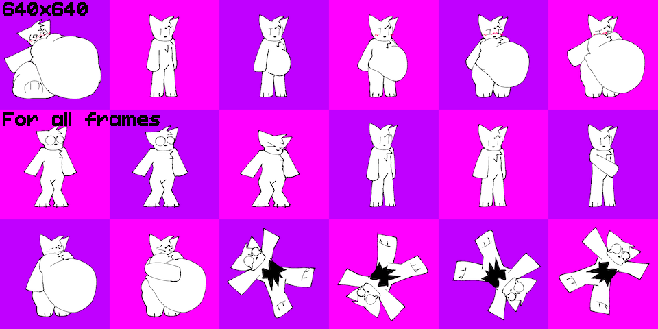
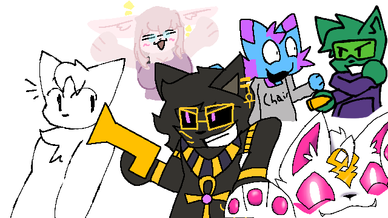
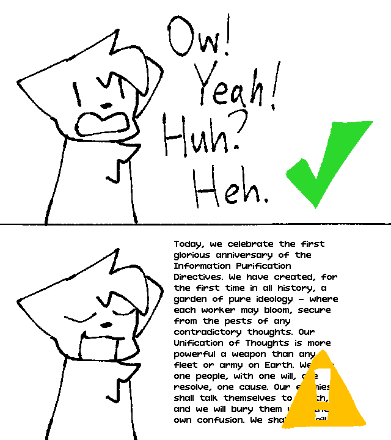

# Character Style Guide
_Inflation Roulette: Reloaded_ encourages creative expression. However, there are some rules that should be followed for the game to be an enjoyable experience.

### Keep in mind that these are just suggestions if you want to make a custom character for the game.

## Uniform Sprite Dimensions
Although offsets for each character animation can be tweaked, it is not suggested that you solely rely on offset tweaking for your sprites. Characters can be mirrored, so their animation offsets may break upon doing so. All frames should be uniform in bounding box width and height.

*For Goober's spritesheet, all frames are bounded by a 640px x 640px box.*

## Your Character, Your Art
Of course, not saying that you mustn't follow the art style, but as of now, all character sprites made are measly programmer art. Artists are encouraged to draw and animate with their own style, and there is nothing wrong about it.

*Goober hanging out with OCs of different art styles.*

## do not be the op roleplay character
Fun is allowed as long as it feels fair and reasonable. The part of the fun is to see your creation struggle with the pressures of luck. Try to balance out Max Pressure with Skills. (Higher your limit, less powerful skills, and vice versa), and make their cost reasonable. (Prices should not exceed Max Confidence)

## Stay Silent
_Inflation Roulette_ is supposed to be a game without any dialogue. Unless they are non-lingual interjections, all characters in this game should not say any voicelines to not break the immersion of the game.

*Goober is only allowed to speak in interjections; not a passage from a Macintosh ad.*

## Keep Your Actions Short
I am fully aware that there will be people animating a whole cutscene for just shooting something, but please, try to keep the animations at just the right length; at most 3 seconds.

The amount of frames determine the length of the animation.
Empty frames are pauses in-between actions. Try to keep them at most 2 seconds to avoid any awkwardness.

*The amount of frames determine the length of the animation.*

## Have Fun
Most importantly, try to keep yourself from ending it all.

# [Back To Main Page](MAIN_PAGE.md)
