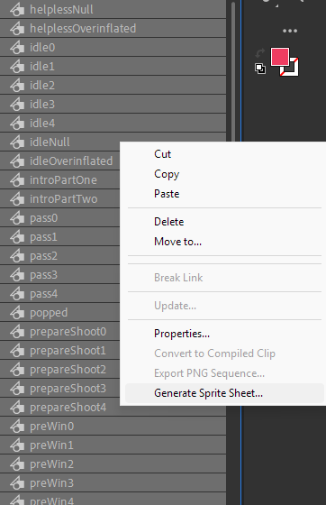
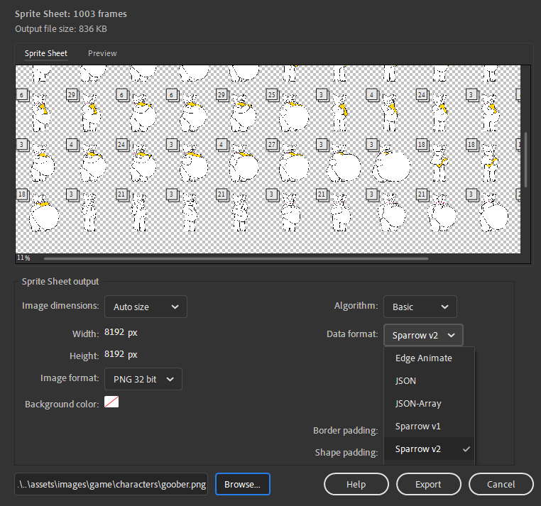
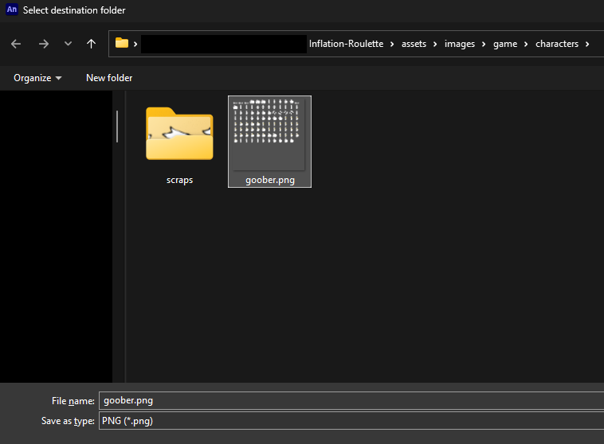
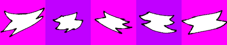

# Custom Character Guide
So, you have decided to do the cardinal sin of making your very own character in _Inflation Roulette_. Here are some steps that you need to follow.

## Recommended Setup
These are the suggested tools that you would need:
- Adobe Animate/Macromedia Flash
- Any high-level text/code editor (e.g. Visual Studio Code)

## Style Guide
It is highly recommended that you read the [Character Style Guide](CHARACTER_STYLE_GUIDE.md) before you proceed to learn what and what not to implement before you plan on creating.
  
## Creating Character JSON Files
There are two JSON files that are used for each character. One for its gameplay parameters (e.g. Max Pressure), and one for its animations and cosmetic parameters (e.g. Creaking Threshold).

You can copy `goober.json` and `sprites/goober.json` in `data/characters` as templates and tweak their values to your liking.

For the full documentation of JSON attributes, please read the [Character JSON Documentation](CHARACTER_JSON_DOCUMENTATION.md).

## Creating Character Sprites
All character sprites are stored using the Starling Format. It is composed of a PNG texture atlas and a XML that stores the position, and size of every animation frame.

Manually editing each frame will be a tedious process, but Adobe Animate/Macromedia Flash has a built-in function that converts selected animation objects (called _Symbols_) into a Starling spritesheet.

*Press 'Generate Sprite Sheet' to export.*

When prompted, set the **'Data format'** to either `Starling` or `Sparrow v2`, and the destination to be `<GAME FOLDER>/assets/images/game/characters/<YOUR-CHARACTER-ID-HERE>.png`.

*Setting 'Data format' to Sparrow v2.*

*Setting destination.*

Once it is all set and done, click **Export**.

For documentation regarding animation names and JSON attributes, please read [Character Animation Documentation](CHARACTER_ANIMATION_DOCUMENTATION.md).

## Creating Scrap Particles
When the character explodes, particles that resemble shed skin tissue will be spawned and launched away at/from the player's position, fluttering in the air until fading away on the ground.

Each particle is stored in the `scraps` folder in the `characters` folder, as a horizontal grid of square sub-images.

*Five scrap sprites, arranged in a row, with square bounding boxes.*

## Creating Sound Effects
Animations are allowed to a sound effect to be played with them.

[This section is a stub. It will be expanded soon]

# [Back To Main Page](MAIN_PAGE.md)